# ActorsFYP
This project aims to engineer a JavaScript framework for building actor-based systems which will use the web as its global distributed platform. The performance and usability of the artifact will then be analysed through empirical measurement.

## Features
* Allow developer to create, terminate and send messages to actors
* Handle distributed communication between actors
* Location transparency, allowing the developer to treat remote actors in the same way as local actors
* Remote spawning allowing developers to create coordinator/worker nodes

## Limitations
* The number of nodes are fixed where each node has the addresses of other nodes
* References to actors can either be communicated as an object or retrieved through remote spawning

## Exported Functions
The programmer interacts with the framework through a set of exported functions. Further documentation of these functions can be found in its [implementation](/src/actors.ts).

The functions can be spawned as follows
```js
import actors from './actors.js';
const { init, spawn, spawnRemote, terminate, send} = actors
```

**spawn**: Spawns a local actor with an initial state and behaviour on ceiving of a message.

The behaviour is specified as a function with the following parameters:
* state: The current state of the actor
* message: The message the actor is processing (through the use of the function)
* self: A self reference to the actor which can be passed locally or remotely

```js
//Function behaviour
const pongBehaviour = (state, message, self) => {
    console.log("My state object is " + state)
    console.log("I'm processing the message object " + message)
    console.log("I can pass the self object so that other nodes and actors can talk to me! " + self)
};

//Spawn an actor with the above behaviour and an initial state
const pongReference = spawn({stateElement: "hello"}, pongBehaviour)
```

**send**: Takes an actor reference (returned by **spawn** or spawnRemote**) and sends a message object to it.

```js
send(pongReference, {messageVal: "This is a message!"})
```

**terminate**: Terminates a local actor. Cannot be used to termiante remote actors.
```js
terminate(pongReference)
```

**init**: Establishes a connection with the WebSocket network server which enables connection with other processes. An optional parameter can be passed to specify the number of workers that need to be spawned, each of which will be connected to the server.
```js
const webSocketServer = 'ws://localhost:8080';
const timeout = 10000;
const numberOfWorkers = 4;

init(webSocketServer, timeout, numberOfWorkers).then(ready => {
    // Put code that will be executed by each of the spawned workers as well as the primary node here. 
    // The object returned from the network will contain information about the assigned network number as well as other nodes connected to the network.
    if (ready.yourNetworkNumber === 1) {
        //Code for node 1 to execute
    }
})
```

**closeConnection**: Closes the established WebSocket connection
```js
closeConnection()
```

**spawnRemote**: Spawns an actor remotely on the node specified by a rameter. The programmer will identify the node by specifying its network number as seen by the network.

This function can only be used following init
```js
init(webSocketServer, timeout, numberOfWorkers).then(ready => {
    //Node 1 will remotely spawn an actor on node 2, both of which are connected to the network. The behaviour function is a simple console log
    if (ready.yourNetworkNumber === 1) {
        spawnRemote(2. {initialStateVal: 1}, (state, message, self) => {console.log("received!")})
    }
})
```

## Actors Everywhere
### Setting up
Use the following script to set up the framework
```bash
npm i
npm i -g typescript
cd src
tsc
```
### Single Threaded Node
Import the TypeScript transpiled [actors.js](src/actors.js) to make use of the framework in your own JavaScript files.

Programmers can reason about their code through the use of isolated communicating actors on a single thread. The following is a complete example of two communicating actors (ping and pong) using the same behaviour. Both actors check a value embedded in the message and decrements it before sending until it reaches 0. With an initial value of 5, ping will console log 5,3,1 and pong will console log 4,2,0.
```js
//Define the behaviour of the two actors. (This behaviour definition is used in the rest of the examples in the README)
const pingPongBehaviour = (state, message, self) => {
    console.log(message.val);
    if(!(message.val-1 < 0))
        send(message.replyTo, {val: message.val-1, replyTo: self});
};

//Spawn actors
const ping = spawn({}, pingPongBehaviour);
const pong = spawn({}, pingPongBehaviour);

//Send ping a message. Output will be decrementing values from 5 to 0
send(ping, {replyTo: pong, val: 5})
```
### Single Threaded Browser
The framework has been ported to use browsers as a platform to run actors. This [implementation](src/browser/actors.js) provides full interoperability for the exported functions between the node and browser implementations. The same code above will run in a browser.

### WebSockets
WebSocket connections facilitate the communicaiton between different nodes and browsers. All clients using the actor framework connect to a WebSocket server running the [star network implementation](src/network.js).

<p align="center">
  
</p>

First, the network must be started with the number of connections it expects. Once that number of connections are established, it will broadcast to the connections that it is ready to handle communication. It will also broadcast the IP's connected to the network as well as their network numbers which can be used to identify where to remotely spawn actors.
```bash
cd src
node network.js 3 #wait for three connections before allowing communication
```

Now that the network is ready and listening on port 8080, we can run the following node applications.
**NODE 1**
```js
init('ws://localhost:8080').then(async ready => {
    //Remotely spawn ping and pong actors in nodes 2 and 3.
    //These network numbers (2 and 3) can be retrieved from the returned object of init which identifies the nodes connected to the network.
    const ping = await spawnRemote(2, {}, pingPongBehaviour);
    const pong = await spawnRemote(3, {}, pingPongBehaviour);

    //Send ping a message. Output will be decrementing values from 5 to 0
    send(ping, {replyTo: pong, val: 5})
});
```
**NODES 2 AND 3**
```js
//Simply connect to the web socket server. This will await any remote spawns and the framework will take care of the actor runtimes
init('ws://localhost:8080')
```
As output node 2 will print out the values 5, 3, 1 for the ping actor while node 3 will print out the valeus 4, 2, 0 for the pong actor. This implementation can be reproduced by using a node application or a browser for any of the nodes. 

Note that the orchestration of nodes 2 and 3 is managed by node 1, including the function definitions of actor behaviours which are sent through the WebSocket link.

### Multiple Threads Node
While WebSockets can be used to facilitate communication between any node or browser running the actor framework, the programmer might wish to focus on performant computing rather than distribution. The actor framework makes use of [Node.js Cluster](https://nodejs.org/api/cluster.html) to allow one to spawn multiple threads in one node application and use IPC to pass messages rather than the WebSocket link.

```js
//Specify timeout and number of workers to spawn
init('ws://localhost:8080', 10000, 2).then(async ready => {
    //The primary node is always 1
    if(ready.yourNetworkNumber === 1){
        const ping = await spawnRemote(2, {}, pingPongBehaviour);
        const pong = await spawnRemote(3, {}, pingPongBehaviour);

        //Send ping a message. Output will be decrementing values from 5 to 0
        send(ping, {replyTo: pong, val: 5})
    }
});
```

This will show the decrementing numbers from 5 to 0, but one should note that the console logs came from different worker threads. Furthermore note that even though a connection with the WebSocket server was estasblihed through init's invocation, it is not relied on when remote spawning or sending messages. Instead, cluster's IPC is used where the primary node forwards the communication between the spawned worker nodes.

<p align="center">
  
</p>

### Multiple Threads Browser
