# ActorsFYP
This project provides two JavaScript frameworks for building actor-based systems on both the Node.js and browser environments respectively. 

## Features
* **Spawn/Terminate** actors and **send** messages to the spawned actors
* **Remotely spawn** actors on distributed nodes
* **Location transparency**, treat remote actors in the same way as local actors
* Allows you to use the actor model to reason about **distributing work** over... 
    * WebSockets
    * Web Workers
    * Node.js Child Processes

## Limitations
* The project makes use of a WebSocket server to handle distributed actors, peer-to-peer is not supported
* The WebSocket server accepts a finite number of connections before allowing clients to communicate. This allows for clients to be able to communicate with every other connected client once everyone connects
* No functionality to allow the freezing and persisting of actors which would allow the potential for migrating actors over the web

## Contents of Note
* `src` - Project source code directory
    * `nodeactors.ts` - Actor model framework for the Node.js environment
    * `browseractors.js` - Actor model framework for the Browser envrionemtn
    * `network.ts` - WebSocket server which forwards communication between distributed Node.js and Browser instances
* `benchmarks` - Benchmarks which test the source code's implementation, including raw data of its performance
    * `browser` - Benchmarks for the Browser framework
        * `micro` - Savina Micro-Benchmarks for the Browser environment
        * `parallel` - Parallel Benchmarks for the Browser environment
    * `node` - Benchmarks for the Node.js framework
        * `micro` - Savina Micro-Benchmarks for the Node.js environment
        * `parallel` - Parallel Benchmarks for the Node.js environment
    * `competitors` - Benchmarks for third party JavaScript actor model implementations listed under 'Similar Work' in the FYP report
    * `visualisations` - Python scripts which take in raw input and output the diagrams used in the FYP report
* `documentation` - Tex files and resources used to compile the required documentation 

## Using the API Locally
You can interact with the framework through a set of exported functions. Further documentation of these functions can be found in its [node implementation](/src/actors.ts).

The functions can be spawned using ES6 modules as follows
```js
import actors from 'actors.js';
const { init, closeConnection, spawn, spawnRemote, terminate, send} = actors;
```

### spawn
Spawns a local actor with an initial state and behaviour which will be used to process each received message.

The behaviour is specified as a function with the following parameters:
* state: The current state of the actor
* message: The message the actor is processing (through the use of the function)
* self: A self reference to the actor which can be passed locally or remotely

```js
//Actor behaviour
const pongBehaviour = (state, message, self) => {
    console.log("My state object is " + state)
    console.log("I'm processing the message object " + message)
    console.log("I can pass the self object so that other nodes and actors can talk to me! " + self)
};

//Spawn an actor with the above behaviour and an initial state
const pongReference = spawn({stateElement: "hello"}, pongBehaviour)
```

### send
Takes an actor reference (returned by **spawn** or **spawnRemote**) and sends a message object to it. The actor's behaviour will be executed when processing this message.

```js
send(pongReference, {someKeyValue: "This is a message!"})
```

### terminate
Terminates a local actor. Cannot be used to terminate remote actors.
```js
terminate(pongReference)
```

## Using the API over a Network
### init
Establishes a connection with the WebSocket server which enables commuincation with other clients. The first optional parameter can be passed to specify the timeout to wait for an acknowledgement from the server. The second optional parameter will specify the number of Web Workers / Node.js Child Processes to spawn, each of which will be connected to the WebSocket server.

The function returns a promise which will resolve into information about the network numbers assigned to the clients on the network.
```js
const webSocketServer = 'ws://localhost:8080';
const timeout = 10000;
const numberOfWorkers = 4;

init(webSocketServer, timeout, numberOfWorkers).then(ready => {
    // Code that all spawned workers will execute
    if (ready.yourNetworkNumber === 1) {
        //Code for node 1 to execute
    }
})
```

### spawnRemote
Spawns an actor on a remote node identified by its assigned network number.
This function can only be used following init's established connection. The first parameter is the remote node's network number, followed by the initial state and actor behaviour.
```js
init(webSocketServer, timeout, numberOfWorkers).then(async ready => {
    //Node 1 will remotely spawn an actor on node 2, both of which are connected to the network. 
    // The behaviour function is a simple console log
    if (ready.yourNetworkNumber === 1) {
        const actorRef = await spawnRemote(2, {initialStateVal: 1}, (state, message, self) => {console.log("received!")})
    }
})
```

### closeConnection
Closes the established WebSocket connection and terminates the instance
```js
closeConnection()
```

## Demo
### Setting up
Make sure to install a modern browser such as [Chrome](https://www.google.com/chrome/) or [Firefox](https://www.mozilla.org/en-US/firefox/new/), as well as [Node.js](https://nodejs.org/en/)

Use the following bash script to set up the framework. This will install the required packages and transpile the TypeScript implementations of the WebSocket network and Node.js actor framework.

```sh
npm i
npm i -g typescript
cd src
tsc
```

### Running actors on a Single Node.js Instance
You must import the transpiled [actors.js](src/actors.js) to make use of the framework in your own JavaScript files.

You can reason about your code through the use of isolated communicating actors on a single instance. The following is a complete example of two communicating actors (ping and pong) using the same behaviour function. Both actors read a value embedded in the received message and decrements it before replying to the sender if the value is larger than 0. With an initial value of 5, ping will console log 5,3,1 and pong will console log 4,2,0.
```js
import actors from 'actors.js';
const { init, closeConnection, spawn, spawnRemote, terminate, send} = actors;

//Define the behaviour of the two actors. (This behaviour definition is used in the rest of the examples in the README)
const pingPongBehaviour = (state, message, self) => {
    console.log(message.val);
    if(!(message.val-1 < 0))
        send(message.replyTo, {val: message.val-1, replyTo: self});
};

//Spawn actors
const ping = spawn({}, pingPongBehaviour);
const pong = spawn({}, pingPongBehaviour);

//Send ping a message. Output will be decrementing values from 5 to 0
send(ping, {replyTo: pong, val: 5})
```

You can run this on Node.js by pasting the code segment in a file and running it using
```sh
node <FILENAME>.js
```
### Single Browser Instance
The [browser implementation](src/browseractors.js) provides full interoperability with the exported functions in the [node implementation](src/nodeactors.ts), allowing you to use the same code segment above on browser. The code segment above can be placed in an HTML script as follows.

```html
<body>
    <h1>ActorsFYP</h1>
    <script type="module">
        import actors from './browseractors.js';
        const { init, closeConnection, spawn, spawnRemote, terminate, send} = actors;
        const pingPongBehaviour = (state, message, self) => {
            console.log(message.val);
            if(!(message.val-1 < 0))
                send(message.replyTo, {val: message.val-1, replyTo: self});
        };
        const ping = spawn({}, pingPongBehaviour);
        const pong = spawn({}, pingPongBehaviour);
        send(ping, {replyTo: pong, val: 5})
    </script>
</body>
```
Most browsers will block the ability to access the `browseractors.js` script for security. To circumvent this, you can host a web server locally using the following package inside the directory where the HTML script resides.
```sh
npm i -g browser-sync
browser-sync
```

The output can be viewed on the browser's console.
### Distribute Instances over WebSocket Server
WebSocket connections facilitate the communicaiton between different nodes and browsers. All clients using the actor framework connect to a WebSocket server running the [star network implementation](src/network.js).

<p align="center">
  
</p>

First, the network must be started with the number of connections it expects. Once that number of connections are established, it will broadcast to the connections that it is ready to handle communication. It will also broadcast the IP's connected to the network as well as their network numbers which can be used to identify where to remotely spawn actors.
```bash
cd src
node network.js 3 #wait for three connections before allowing communication
```

Now that the network is ready and listening on port 8080, we can run the following node applications.
**NODE 1**
```js
init('ws://localhost:8080').then(async ready => {
    //Remotely spawn ping and pong actors in nodes 2 and 3.
    //These network numbers (2 and 3) can be retrieved from the returned object of init which identifies the nodes connected to the network.
    const ping = await spawnRemote(2, {}, pingPongBehaviour);
    const pong = await spawnRemote(3, {}, pingPongBehaviour);

    //Send ping a message. Output will be decrementing values from 5 to 0
    send(ping, {replyTo: pong, val: 5})
});
```
**NODES 2 AND 3**
```js
//Simply connect to the web socket server. This will await any remote spawns and the framework will take care of the actor runtimes
init('ws://localhost:8080')
```
As output node 2 will print out the values 5, 3, 1 for the ping actor while node 3 will print out the values 4, 2, 0 for the pong actor. This implementation can be reproduced by using a node application or a browser for any of the nodes. 

Note that the orchestration of nodes 2 and 3 is managed by node 1, including the function definitions of actor behaviours which are sent through the WebSocket link.

### Multiple Node Processes
While WebSockets can be used to facilitate communication between any node or browser running the actor framework, the programmer might wish to focus on performant computing rather than distribution. The actor framework makes use of [Node.js Cluster](https://nodejs.org/api/cluster.html) to allow one to spawn multiple threads in one node application and use IPC to pass messages rather than the WebSocket link.

```js
//Specify timeout and number of workers to spawn
init('ws://localhost:8080', 10000, 2).then(async ready => {
    //The primary node is always 1
    if(ready.yourNetworkNumber === 1){
        const ping = await spawnRemote(2, {}, pingPongBehaviour);
        const pong = await spawnRemote(3, {}, pingPongBehaviour);

        //Send ping a message. Output will be decrementing values from 5 to 0
        send(ping, {replyTo: pong, val: 5})
    }
});
```

This will show the decrementing numbers from 5 to 0, but one should note that the console logs came from different worker threads. Furthermore note that even though a connection with the WebSocket server was estasblihed through init's invocation, it is not relied on when remote spawning or sending messages. Instead, cluster's IPC is used where the primary node forwards the communication between the spawned worker nodes.

<p align="center">
  
</p>

### Multiple Browser Instances
As previously mentioned, the [browser implementation](src/browser/actor.js) provides abstractions with full interoperability with [node's implementation](src/actor.ts) of the actor framework. The same code above will work on a browser as it makes use of [Web Workers](https://developer.mozilla.org/en-US/docs/Web/API/Web_Workers_API/Using_web_workers) instead.

<p align="center">
  
</p>

## Adaptive and Flexible Communication
The actor framework allows one to more easily orchestrate the communication and behaviour of nodes and browsers which may be distributed in multiple devices.

The following diagram is a scenario which uses all communication links abstracted in the framework. Some links have been omitted to keep the graph neat, as a WebSocket link is established between Web Workers and the network as well as cluster worker nodes and the network.

<p align="center">
  
</p>

## Running the Benchmarks and Rendering Visualisations
This goes through instructions on how to reproduce the diagrams shown in the write-up

### Micro Comparision

### Parallel Speedup

### Micro Benchmark Scaling

### Link Comparision