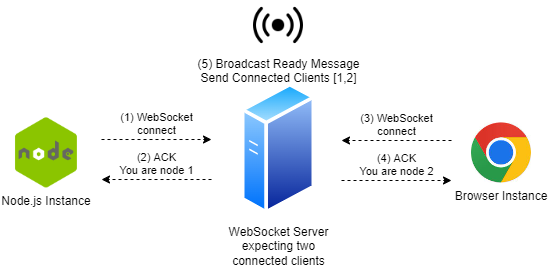
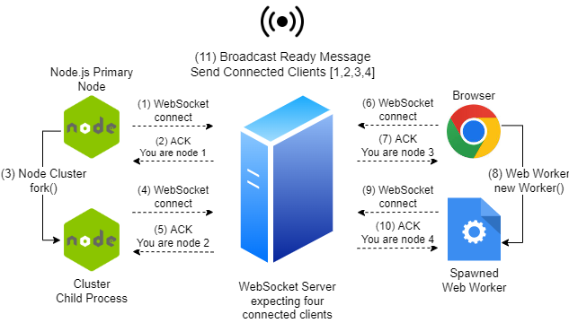
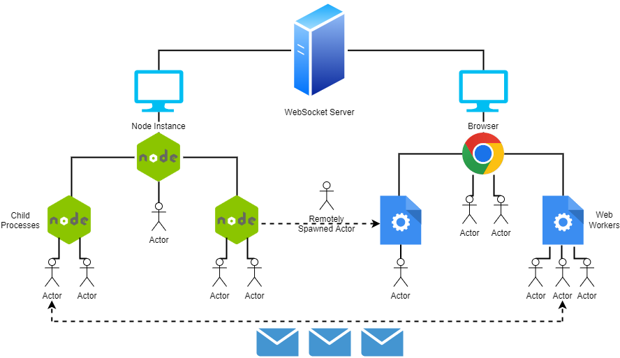

# ActorsFYP
This project provides two JavaScript frameworks for building actor-based systems on both the Node.js and browser environments respectively. 

## Features
* **Spawn/Terminate** actors and **send** messages to the spawned actors
* **Remotely spawn** actors on distributed nodes
* **Location transparency**, treat remote actors in the same way as local actors
* Allows you to use the actor model to reason about **distributing work** over... 
    * WebSockets
    * Web Workers
    * Node.js Child Processes

## Limitations
* The project makes use of a WebSocket server to handle distributed actors, peer-to-peer is not supported
* The WebSocket server accepts a finite number of connections before allowing clients to communicate. This allows for clients to be able to communicate with every other connected client once everyone connects
* No functionality to allow the freezing and persisting of actors which would allow the potential for migrating actors over the web

## Contents of Note
* `src` - Project source code directory
    * `nodeactors.ts` - Actor model framework for the Node.js environment
    * `browseractors.js` - Actor model framework for the Browser environment
    * `network.ts` - WebSocket server which forwards communication between distributed Node.js and Browser instances
* `benchmarks` - Benchmarks which test the source code's implementation, including raw data of its performance
    * `browser` - Benchmarks for the Browser framework
        * `micro` - Savina Micro-Benchmarks for the Browser environment
        * `parallel` - Parallel Benchmarks for the Browser environment
    * `node` - Benchmarks for the Node.js framework
        * `micro` - Savina Micro-Benchmarks for the Node.js environment
        * `parallel` - Parallel Benchmarks for the Node.js environment
    * `competitors` - Benchmarks for third party JavaScript actor model implementations listed under 'Similar Work' in the FYP report
    * `visualisations` - Python scripts which take in raw input and output the diagrams used in the FYP report
* `documentation` - Tex files and resources used to compile the required documentation 

## Using the API Locally
You can interact with the framework through a set of exported functions. Further documentation of these functions can be found in its [node implementation](/src/nodeactors.ts).

The functions can be spawned using ES6 modules as follows
```js
import actors from 'actors.js';
const { init, closeConnection, spawn, spawnRemote, terminate, send} = actors;
```

### spawn
Spawns a local actor with an initial state and behaviour which will be used to process each received message.

The behaviour is specified as a function with the following parameters:
* state: The current state of the actor
* message: The message the actor is processing (through the use of the function)
* self: A self reference to the actor which can be passed locally or remotely

```js
//Actor behaviour
const pongBehaviour = (state, message, self) => {
    console.log("My state object is " + state)
    console.log("I'm processing the message object " + message)
    console.log("I can pass the self object so that other nodes and actors can talk to me! " + self)
};

//Spawn an actor with the above behaviour and an initial state
const pongReference = spawn({stateElement: "hello"}, pongBehaviour)
```

### send
Takes an actor reference (returned by **spawn** or **spawnRemote**) and sends a message object to it. The actor's behaviour will be executed when processing this message.

```js
send(pongReference, {someKeyValue: "This is a message!"})
```

### terminate
Terminates a local actor. Cannot be used to terminate remote actors.
```js
terminate(pongReference)
```

## Using the API over a Network
### init
Establishes a connection with the WebSocket server which enables commuincation with other clients. The first optional parameter can be passed to specify the timeout to wait for an acknowledgement from the server. The second optional parameter will specify the number of Web Workers / Node.js Child Processes to spawn, each of which will be connected to the WebSocket server.

The function returns a promise which will resolve into information about the network numbers assigned to the clients on the network.
```js
const webSocketServer = 'ws://localhost:8080';
const timeout = 10000;
const numberOfWorkers = 4;

init(webSocketServer, timeout, numberOfWorkers).then(ready => {
    // Code that all spawned workers will execute
    if (ready.yourNetworkNumber === 1) {
        //Code for node 1 to execute
    }
})
```

### spawnRemote
Spawns an actor on a remote node identified by its assigned network number.
This function can only be used following init's established connection. The first parameter is the remote node's network number, followed by the initial state and actor behaviour.
```js
init(webSocketServer, timeout, numberOfWorkers).then(async ready => {
    //Node 1 will remotely spawn an actor on node 2, both of which are connected to the network. 
    // The behaviour function is a simple console log
    if (ready.yourNetworkNumber === 1) {
        const actorRef = await spawnRemote(2, {initialStateVal: 1}, (state, message, self) => {console.log("received!")})
    }
})
```

### closeConnection
Closes the established WebSocket connection and terminates the instance
```js
closeConnection()
```

## Demo
### Setting up
Make sure to install a modern browser such as [Chrome](https://www.google.com/chrome/) or [Firefox](https://www.mozilla.org/en-US/firefox/new/), as well as [Node.js](https://nodejs.org/en/)

Use the following bash script to set up the framework. This will install the required packages and transpile the TypeScript implementations of the WebSocket network and Node.js actor framework.

```sh
npm i
npm i -g typescript
cd src
tsc
```

### Running actors on a Single Node.js Instance
You must import the transpiled [actors.js](src/actors.js) to make use of the framework in your own JavaScript files.

You can reason about your code through the use of isolated communicating actors on a single instance. The following is a complete example of two communicating actors (ping and pong) using the same behaviour function. Both actors read a value embedded in the received message and decrements it before replying to the sender if the value is larger than 0. With an initial value of 5, ping will console log 5,3,1 and pong will console log 4,2,0.
```js
import actors from 'actors.js';
const { init, closeConnection, spawn, spawnRemote, terminate, send} = actors;

//Define the behaviour of the two actors. (This behaviour definition is used in the rest of the examples in the README)
const pingPongBehaviour = (state, message, self) => {
    console.log(message.val);
    if(!(message.val-1 < 0))
        send(message.replyTo, {val: message.val-1, replyTo: self});
};

//Spawn actors
const ping = spawn({}, pingPongBehaviour);
const pong = spawn({}, pingPongBehaviour);

//Send ping a message. Output will be decrementing values from 5 to 0
send(ping, {replyTo: pong, val: 5})
```

You can run this on Node.js by pasting the code segment in a file and running it using
```sh
node <FILENAME>.js
```
### Single Browser Instance
The [browser implementation](src/browseractors.js) provides full interoperability with the exported functions in the [node implementation](src/nodeactors.ts), allowing you to use the same code segment above on browser. The code segment above can be placed in an HTML script as follows.

```html
<body>
    <h1>ActorsFYP</h1>
    <script type="module">
        import actors from './browseractors.js';
        const { init, closeConnection, spawn, spawnRemote, terminate, send} = actors;
        const pingPongBehaviour = (state, message, self) => {
            console.log(message.val);
            if(!(message.val-1 < 0))
                send(message.replyTo, {val: message.val-1, replyTo: self});
        };
        const ping = spawn({}, pingPongBehaviour);
        const pong = spawn({}, pingPongBehaviour);
        send(ping, {replyTo: pong, val: 5})
    </script>
</body>
```
Most browsers will block the ability to access the `browseractors.js` script for security. To circumvent this, you can host a web server locally using the following package inside the directory where the HTML script resides.
```sh
npm i -g browser-sync
browser-sync
```

The output can be viewed on the browser's console.
### Distribute Instances over WebSocket Connections
WebSocket connections facilitate the communication between different nodes and browsers. All clients using the actor framework may connect to a running [WebSocket server](src/network.js) using the init function.

<p align="center">
  
</p>

First, the server must be started and you must pass in the number of clients it should expect. Once the specified number of connections are established, it will broadcast to the connected clients information regarding all of the clients which are connected to the network. This broadcast is an indication to connected clients that the server is ready to forward messages, which will resolve the init function's returned promise.

```bash
cd src
node network.js <NUMBER OF CLIENTS>
```

Now that the network is ready and listening on port 8080, we can run the following Node.js or browser instances. Each connected client will be assigned a unique number which increments per connected client, starting from 1.

**INSTANCE 1**

Instance 1 will remotely spawn the ping and pong actors on instances 2 and 3 once the server receives three WebSocket connections. It will then send to the ping actor in instance 2 a message.
```js
init('ws://localhost:8080').then(async ready => {
    const ping = await spawnRemote(2, {}, pingPongBehaviour);
    const pong = await spawnRemote(3, {}, pingPongBehaviour);

    send(ping, {replyTo: pong, val: 5})
});
```
**INSTANCES 2 AND 3**

Instances 2 and 3 simply connect to the WebSocket server. This will await any remote spawns and the framework will take care of the actor runtimes when receiving messages.
```js
init('ws://localhost:8080')
```
Instance 2 will console log out the values 5, 3, 1 for the ping actor while instance 3 will console log out the values 4, 2, 0 for the pong actor.

Note that the orchestration of instances 2 and 3 is managed by instance 1, including the function definitions of actor behaviours which are sent through the WebSocket link.

### Parallelise Work over Shared Memory
While WebSockets can be used to facilitate communication between any node or browser running the actor framework, the programmer might wish to take advantage of shared memory to make up for JavaScript's single-threaded nature. The actor framework makes use of [Node.js Cluster](https://nodejs.org/api/cluster.html) or [Web Workers](https://developer.mozilla.org/en-US/docs/Web/API/Web_Workers_API/Using_web_workers) to allow one to spawn multiple threads and use IPC to pass messages rather than the WebSocket link.

This is done by passing the init function's optional parameters. The second parameter specifies the timeout while the third parameter specifies the number of Web Workers or Node.js child processes to spawn.
```js
init('ws://localhost:8080', 10000, 2).then(async ready => {
    if(ready.yourNetworkNumber === 1){
        const ping = await spawnRemote(2, {}, pingPongBehaviour);
        const pong = await spawnRemote(3, {}, pingPongBehaviour);

        send(ping, {replyTo: pong, val: 5})
    }
});
```

Note that an if statement is added since each spawned worker will connect to the WebSocket network and execute the code inside. It takes advantage of the unique naming convention between connected instances to have only the first connected node to execute a chunk of code. The same behaviour as the distributed WebSocket example above is replicated through the use of IPC instead.

This will console log the decrementing numbers from 5 to 0, but one should note that the console logs came from different worker threads. Note that even though a connection with the WebSocket server was established through init's invocation, it is not relied on when remote spawning or sending messages. Instead, IPC is used where the primary node forwards the communication between the spawned worker nodes.

<p align="center">
  
</p>

## Adaptive and Flexible Communication
The actor framework allows one to more easily orchestrate the communication and behaviour of nodes and browsers which may be distributed in multiple devices.

The following diagram is a scenario which uses all communication links abstracted in the framework. Some links have been omitted to keep the graph neat, as a WebSocket link is established between Web Workers and the network as well as cluster worker nodes and the network.

<p align="center">
  
</p>

## Rendering Visualisations
The raw data of the benchmarks ran for the FYP report's discussion is present in the `benchmarks/visualisations/results` directory. You can render the graphs used in the report by executing the provided shell script. This provides transparency on how the raw data is presented in the report.
```sh
pip3 install matplotlib numpy scipy
./refresh.sh
```

## Running the Benchmarks
This section will go through executing each of the benchmarks which are presented on the report. The results obtained from running these benchmarks can then be visualised by using the python scripts discussed above.

### Micro-Benchmarks Comparison
**RESULTS FOR THIS BENCHMARK CAN BE FOUND ON** `benchmarks/visualisations/data/micro`

Execute the Savina implementation of the Micro-Benchmarks on Node.js
```sh
cd benchmarks/node/micro
./benchmark.sh
```

Then execute the Micro-Benchmarks on the browser. Separate benchmarks are provided to make use of the different import and environment. 

First the `index.html` must be specified to execute the micro-benchmarks as follows.

```html
<body>
    <h1>ActorsFYP</h1>
    <script type="module" src="./micro/big.js"></script>
    <script type="module" src="./micro/chameneos.js"></script>
    <script type="module" src="./micro/count.js"></script>
    <script type="module" src="./micro/fib.js"></script>/
    <script type="module" src="./micro/fjcreate.js"></script>
    <script type="module" src="./micro/fjthrput.js"></script>
    <script type="module" src="./micro/pingpong.js"></script>
    <script type="module" src="./micro/threadring.js"></script>
</body>
```

To host this HTML which launches each of the micro-benchmarks, you must first copy the browser actor framework to this directory.

```sh
cp src/browseractors.js benchmarks/browser/
```

Then, expose the web server using `browser-sync` and visit the HTML page using google chrome with logging enabled

```sh
cd benchmarks/browser/  #Go to directory
browser-sync --no-open  #Host web server exposing this directory
google-chrome --enable-logging --v=0    #Launch chrome with logging
```

**NOTE:** Do not inspect element or open the console as this slows down the benchmarks significantly. This may be due to chrome entering debug mode.

When the processor becomes idle, the benchmarks are done and the logs are saved. You can then copy the logs to your home directory as follows.
```sh
cp ~/.config/google-chrome/chrome_debug.log ~/micro.log
```

### Micro-Benchmark Scaling
**RESULTS FOR THIS BENCHMARK CAN BE FOUND ON** `benchmarks/visualisations/data/loadscaling`

A script is provided for Node.js
```sh
cd benchmarks/node/micro
./scaling.sh
```

Collecting the scaling results of micro-benchmarks on browser involves gathering logs for different loads. Runtime information for executing a small load of each of the micro-benchmarks is to be saved as `1x.log`, and should be scaled up to `10x.log` for visualisation.
### Communication Links Comparison
**RESULTS FOR THIS BENCHMARK CAN BE FOUND ON** `benchmarks/visualisations/data/commlinks`

For these benchmarks, a running WebSocket server is required which expects 2 clients
```sh
cd src
node network.js 2
```

For Node.js, the following JavaScript files must be run on Node.js
```sh
cd benchmarks/node/parallel/
node pingpongnet.js
#Reset the WebSocket server
node fjcreatenet.js
```

To switch from shared memory (Web Workers and Child Processes) to distributed memory, remove the optional parameters of the init function. A commented invocation of this function is provided. Note that two running instances of the same benchmark must be run as it is no longer spawning an addictional worker.
```sh
node pingpongnet.js
node pingpongnet.js
#Reset the WebSocket server
node fjcreatenet.js
node fjcreatenet.js
```

To run on the browser, the `index.html` file can be modified to run these benchmarks.
```html
<body>
    <h1>ActorsFYP</h1>
    <script type="module" src="./parallel/pingpongnet.js"></script>
    <script type="module" src="./parallel/fjcreatenet.js"></script>
</body>
```

Refer to the previous benchmark on executing these benchmarks on a Google Chrome browser.
### Savina Benchmarks Comparison
**RESULTS FOR THIS BENCHMARK CAN BE FOUND ON** `benchmarks/visualisations/data/savina/`

The JVM implementations for Ping Pong and Fork-Join (create) Micro-Benchmarks found on the [Savina Github Repository](https://github.com/shamsimam/savina) are run with the same configurations as this FYP's JavaScript implementation. These two micro-benchmarks are also implemented using [Nact](https://nact.xyz/) which can be found on `benchmarks/competitors/nact`.

### Parallel Benchmarks Shared Memory Speedup
**RESULTS FOR THIS BENCHMARK CAN BE FOUND ON** `benchmarks/visualisations/data/speedup/sharedmemory`

The parallel benchmarks for Node.js can be executed as follows.

```sh
cd benchmarks/node/parallel
./parallel_benchmark.sh
cd mandelbrot
./mandelbrot.sh
```

These scripts will run the parallel benchmarks using different numbers of workers and will output each of the runs on a separate file.

You can pass in arguments to the parallel mandelbrot benchmark to get the pixel output, which can be rendered into an image using `renderer.py`

<p align="center">
  
</p>


The browser counterpart can be found in `benchmarks/browser/parallel`. However, to run these benchmarks you must manipulate `benchmarks/browser/index.html` to specify the files as well as restart the WebSocket server between each run.

```sh
cd src
node network.js <NUMBER OF CONNECTIONS>
```

index.html
```html
<body>
    <h1>ActorsFYP</h1>
    <script type="module" src="./parallel/mandelbrot/mandelbrot.js"></script>
    <script type="module" src="./parallel/mandelbrot/mandelbrotnoharvest.js"></script>
    <script type="module" src="./parallel/piprecision.js"></script>
    <script type="module" src="./parallel/trapezoid.js"></script>
</body>
```

The number of spawned Web Workers must be modified in the benchmark source code, and you must run only one benchmark at a time due to the WebSocket server limitations of expecting only a finite number of connections.